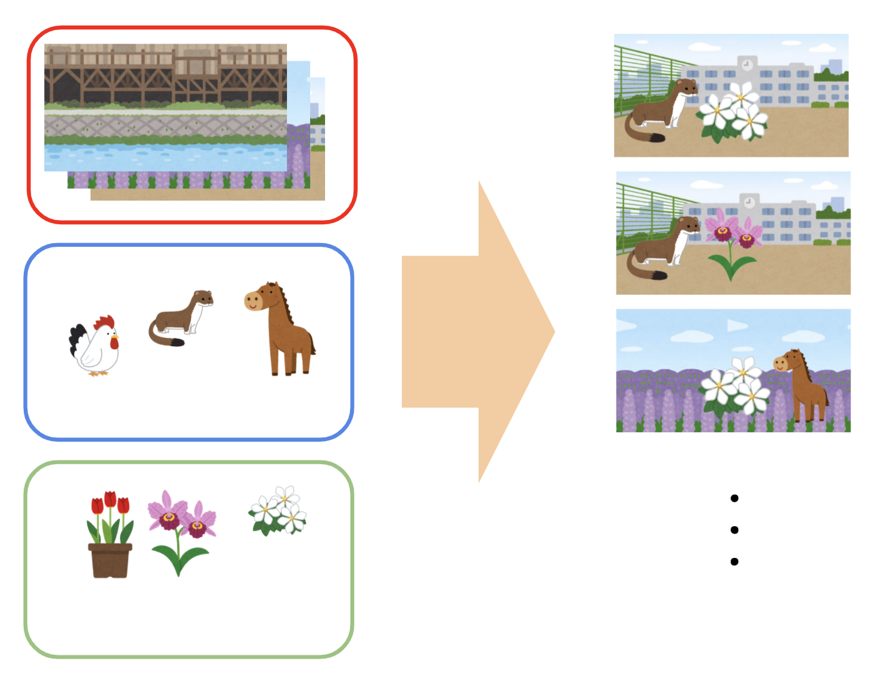
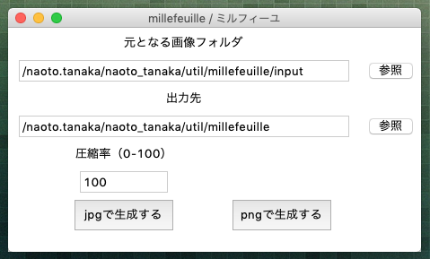

### millefeuille / ミルフィーユ  
組み合わせ画像生成スクリプト  
  
### 変更ログ
**2021/01/22**  
実装  
  
**2021/03/06**  
生成ファイルの命名ルールを変更  
  
**2021/03/06**  
jpg変換・圧縮機能追加  
  
### このスクリプトについて  
カテゴリ分けされた複数のpngファイルから、組み合わせて重ねた画像を生成します。  
ジェネレータ系のog画像量産などに。  
  
  
### 準備(mac想定)  
1. ミルフィーユのファイル(zip)をDLして展開  
https://drive.google.com/file/d/1TPSTw7Aq3qvShRj_D9OjYuFOGmwLUyTe/view?usp=sharing  
  
2. anacondaをインストール  
https://www.anaconda.com/products/individual#Downloads  
  
3. インストールした「Anaconda-Navigator」を開いて、パッケージ**pillow**をインストール  
インストール方法は下記シートにまとめてます。  
https://docs.google.com/presentation/d/1AFRKQdhrRJ-LIN5AVGqhUQTrJipOw8sKKgGMdHL1NR4/edit?usp=sharing

4. ターミナルを開いて、下記を入力してEnter。  
```
conda activate [anacondaで入れた名前]
```
  
5. Finderで解凍したミルフィーユのフォルダを選んで、`[Command] + [Option] + C`を押してフォルダのパスをコピー  
  
6. ターミナルで下記を入力してEnter  
```
cd [コピーしたフォルダのパス]
```
※cdを入力した後に半角スペースあけて、`[Command] + V`でパス貼り付け  
  
6. ターミナルで下記を入力してEnterで起動します。  
```
python millefeuille.py
```
  
\######  
  
準備は以上です。
  
※python3系で動作確認。  
  
※画像処理用ライブラリとして`pillow`を使ってます。  
スクリプトを利用する際はpyenvやanacondaなどで`pillow`を導入してください。  
  
### 使い方  
<b>※画像枚数やPCスペックによっては処理が激重になるので、初めは少ない枚数から試してください。</b>  
  
1. `input_sample`と同じ構造でディレクトリを作成し、画像を格納してください。  
ディレクトリ名や画像ファイル名はなんでもいいですが、拡張子は`png`で、第一階層がディレクトリ、第二階層が画像、になっている必要があります。    
```
input_sample
├── [ディレクトリ名A]
│   ├── [画像ファイル名A1].png
│   ├── [画像ファイル名A2].png
│   └── [画像ファイル名A3].png
├── [ディレクトリ名B]
│   ├── [画像ファイル名B1].png
│   ├── [画像ファイル名B2].png
│   └── [画像ファイル名B3].png
└── [ディレクトリ名C]
    ├── [画像ファイル名C1].png
    ├── [画像ファイル名C2].png
    └── [画像ファイル名C3].png
```  
  
2. スクリプトを実行します。  
`python millefeuille.py`  
guiが立ち上がります。  
  
  
  
3. [参照]から、「元となる画像フォルダ」に、画像ファイルを格納したフォルダ（input_sample みたいな）のパスを入力します。  
  
4. [参照]から、「出力先」に、生成画像を出力したいディレクトリのパスを入力します。  
  
5. 生成ボタンを押します。  
「jpgで生成する」を押すと、上で入力した圧縮率で圧縮したjpgが生成されます。  
「pngで生成する」を押すと、圧縮せずにpngで生成されます。  
出力先ディレクトリに`output`というディレクトリが作られ、中に画像を生成します。  
出力されるファイル名は、元にしたファイル名から拡張子を除いたものをつないだものになります。  
  
### tips  
- finderで名前昇順で一番上にくるフォルダをベースに、二番目、三番目、と画像を重ねていきます。  
- ベース画像のサイズを基準に、左上詰めで画像を重ねます。  
基本的には全て同じサイズの画像で実行してください。  
- 位置合わせは画像の余白で調整してください。